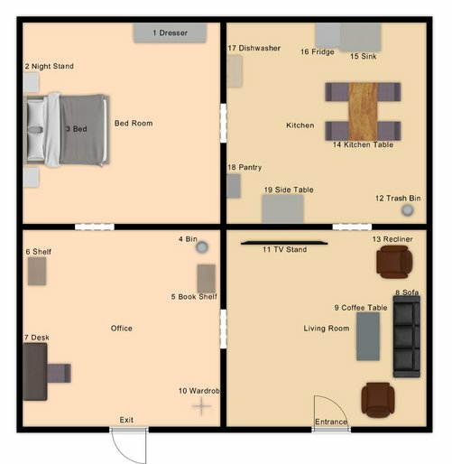
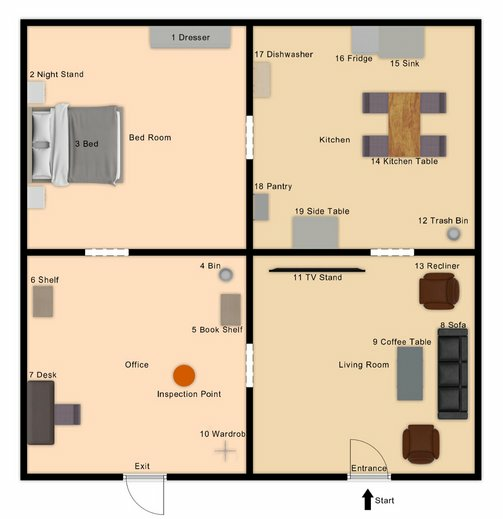
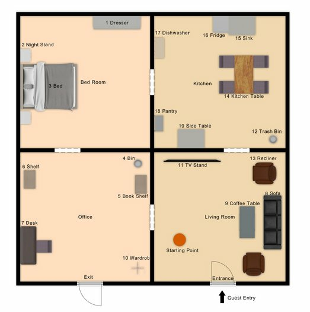
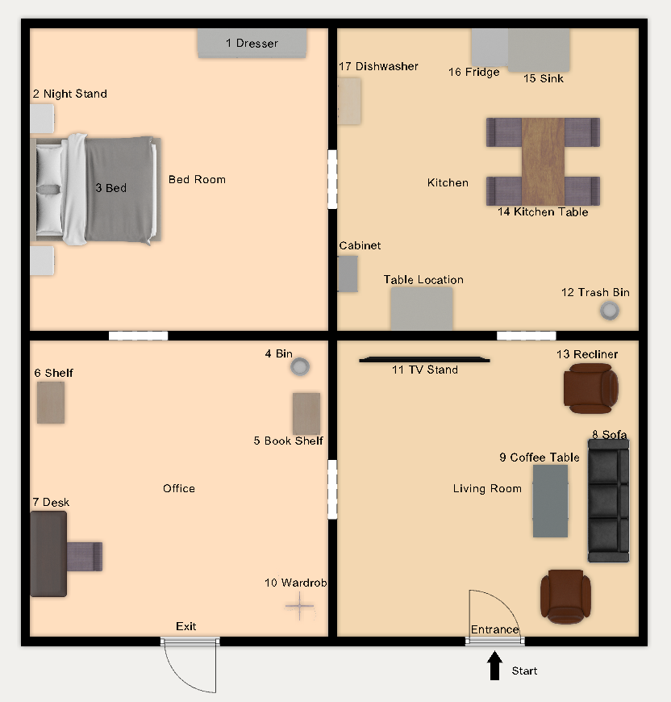
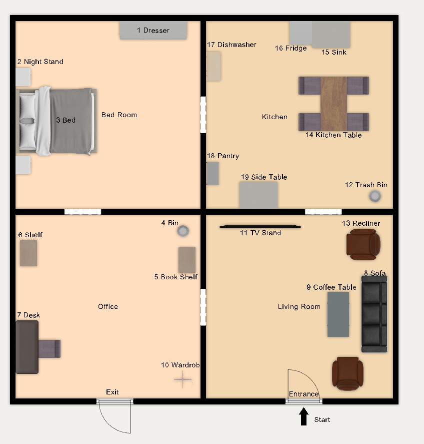
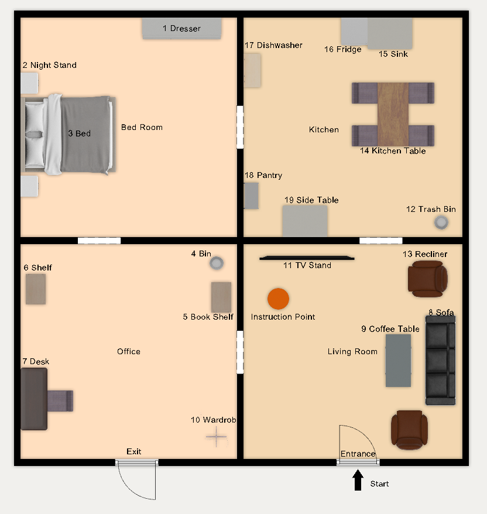
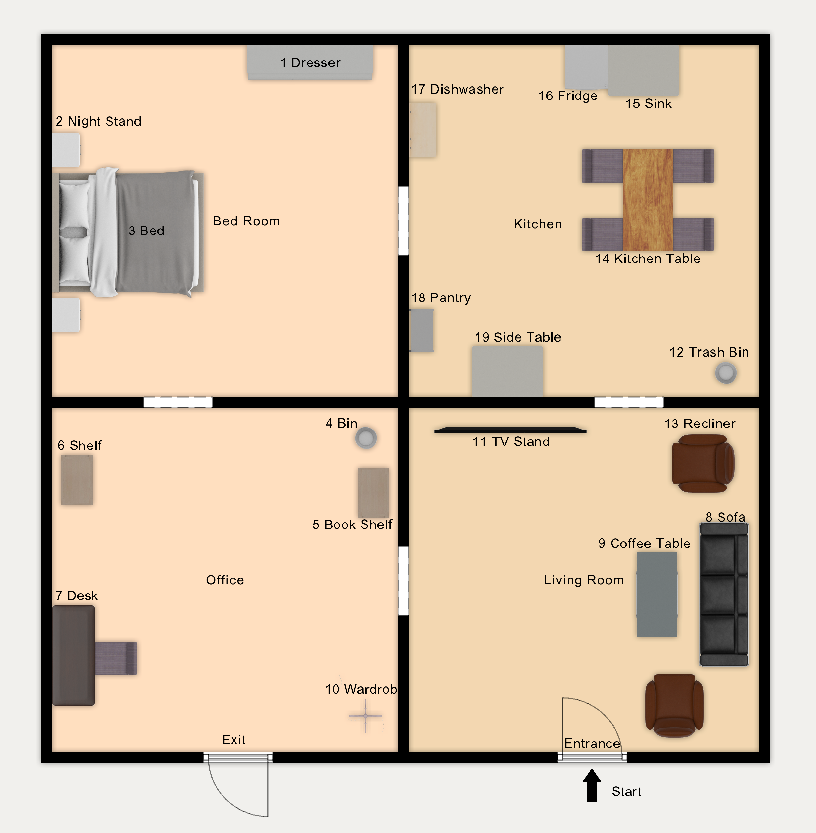
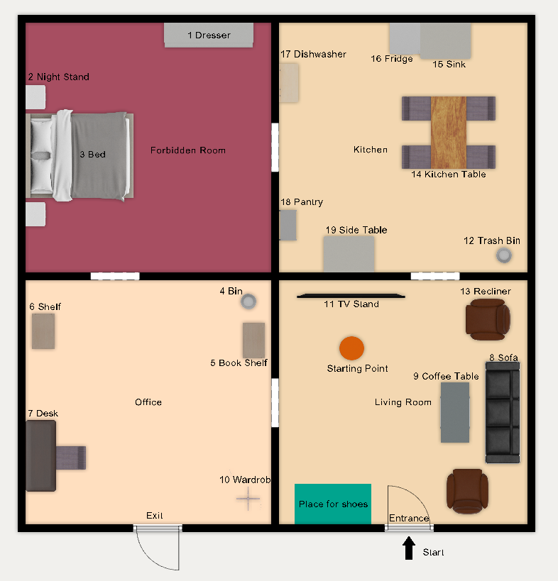

# Coura2024

## Table of Contents

- [Scores](#scores)
- [Schedule](#schedule)
    + [Arena Mapping Slots](#arena-mapping-slots)
- [Arenas](#arenas)
    + [OPL Teams](#opl-teams)
    + [Arena Map](#arena-map)
- [Robot Inspection and Poster Session](#robot-inspection-and-poster-session)
- [Stage 1](#stage-1)
    + [Receptionist](#receptionist)
    + [Storing Groceries](#storing-groceries)
    + [Carry my Luggage](#carry-my-luggage)
    + [Serve Breakfast](#serve-breakfast)
    + [GPSR](#gpsr)
- [Stage 2](#stage-2)
    + [Clean the Table](#clean-the-table)
    + [Stickler for the Rules](#stickler-for-the-rules)
    + [EGPSR](#egpsr)

## Scores

| (current) rank   | Team Name   | Poster | Storing G. | Recept. | Carry L. | GPSR | Serve B. | Total scores (stage 1) |
| ---------------- | ----------- | ------ | ---------- | ------- | -------- | --- | ----- | ---------------------- |
| 2 | Gentlebots                 | -      | 15         | 555     | 565       |  -  | -     | 1135 |
| 1 | LAR@Home                   | -      | 135        | 645     | 115      | -   | 610   | 1505 |
| 3 | SocRob@Home                | -      | 95         | 580     | -        |  300  | -     | 975 |

| (current) rank   | Team Name   | Stage 1 | E-GPSR | Clean T. | Restaurant | Stickler R. | Total scores (stage 1+2) |
| ----------------  | ----------- | ------ | ---------- | ------- | -------- | --- | ------------------- |
| 3 | Gentlebots    | 1135     |   -        |   -     |     -     |  -   | 1135 |
| 1 | LAR@Home      | 1505   | -        |   15   |   1120    | 500  | 3140 |
| 2 | SocRob@Home   | 975    | 150      |   -   |  200   | 1000 | 2325 |

## Schedule

|     | Thu May 2 | Fri May 3 | Sat May 4 | Sun May 5 |
|-----|------------|------------|------------|------------|
|09:00|     |  |  |  | |
|10:00|     | Receptionist | Serve Breakfast | Restaurant | |
|11:00| |  |  |EGPSR  | |
|12:00| | | |  | |
|13:00| |  | GPSR |  | |
|13:30| | | |  Closing Ceremony| |
|14:00| |   |  |  | |
|14:30| | Opening Ceremony  |  |  | |
|15:00| |   |  |  | |
|15:30| | Carry my luggage  |  |  | |
|16:00| Team Leader Meeting | | Stickler for the Rules | | |
|17:00|  |  |  |  | |
|18:00|  | Storing Groceries |  |  | |
|18:30|  |  | Clean the Table |  | |
|19:00| |  |  |  | |
|19:30| Robot Inspection | Team-Leader Meeting | Team-Leader Meeting | | |

### Robot Inspection
Team Order|
|-------|
|LAR@Home|
|SocRob@Home|
|Gentlebots|

### Receptionist
Team Order|
|-------|
|Gentlebots|
|LAR@Home|
|SocRob@Home|

### Carry my luggage
Team Order|
|-------|
|SocRob@Home|
|Gentlebots|
|LAR@Home|

### Storing Groceries
Team Order|
|-------|
|LAR@Home|
|SocRob@Home|
|Gentlebots|

### Serve Breakfast
Team Order|
|-------|
|LAR@Home|
|SocRob@Home|
|Gentlebots|

### GPSR
Team Order|
|-------|
|Gentlebots|
|LAR@Home|
|SocRob@Home|

### Stickler/Clean the Table
Team Order|
|-------|
|SocRob@Home|
|Gentlebots|
|LAR@Home|

### Stickler/Clean the Table
Team Order|
|-------|
|LAR@Home|
|SocRob@Home|
|Gentlebots|

## Arenas

### OPL Teams
| Team Name (OPL) | Arena |
|-----------|-------|
|Gentlebots (Universidad Rey Juan Carlos / Universidad de León, Spain) |	OPL |
|LAR@Home (University of Minho, Portugal)	|	OPL |
|SocRob@Home (Institute for Systems and Robotics/Instituto Superior Técnico, Portugal)	|	OPL |

### Arena Map

## Robot Inspection and Poster Session

Announce location for Poster.

## Stage 1

### Receptionist

Host's favorite drink: Iced Tea

Host's name: Noah

### Storing Groceries

Announce which table will be used: Side Table

Announce what will be used as cabinet: Pantry

### Carry my Luggage

### Serve Breakfast

The breakfast needs to be served on the kitchen table

### GPSR

## Stage 2

### Clean the Table

Dishes are on the kitchen table

The dish washer tab will be on the fridge

### Stickler for the Rules

The bedroom is the forbidden room

Shoes need to be near the entrance inoutlined area

Trash can be dropped in either the bin or the trash bin

### EGPSR

