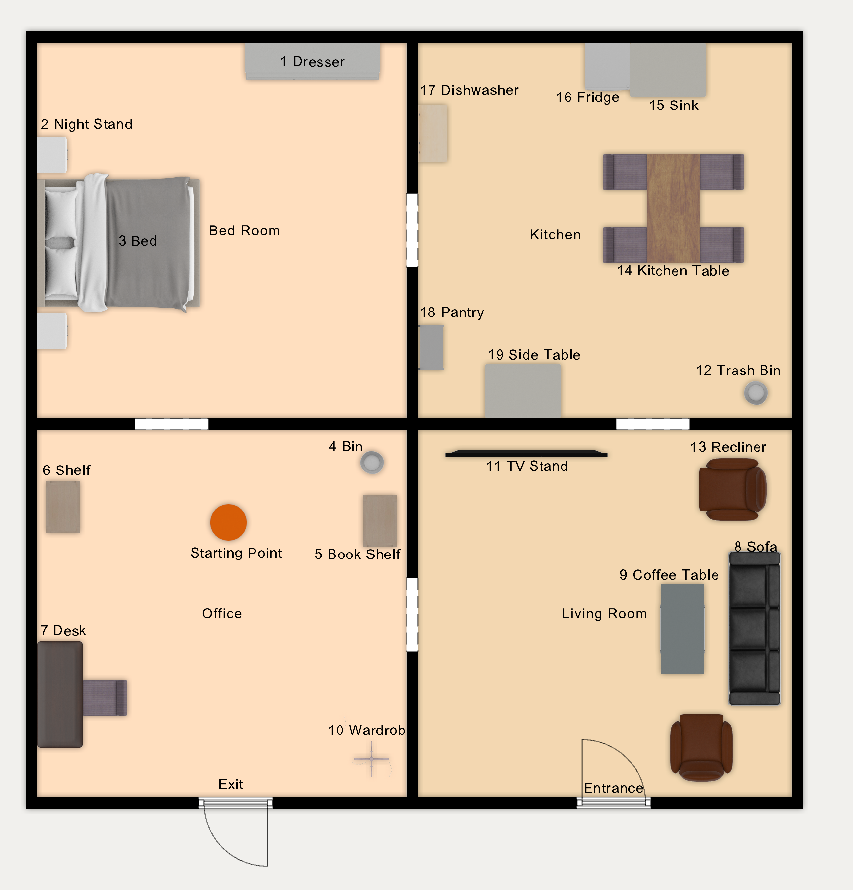

# Coura2024

## Table of Contents

- [Scores](#scores)
- [Schedule](#schedule)
    + [Arena Mapping Slots](#arena-mapping-slots)
- [Arenas](#arenas)
    + [OPL Teams](#opl-teams)
    + [Arena Map](#arena-map)
- [Robot Inspection and Poster Session](#robot-inspection-and-poster-session)
- [Stage 1](#stage-1)
    + [Receptionist](#receptionist)
    + [Storing Groceries](#storing-groceries)
    + [Carry my Luggage](#carry-my-luggage)
    + [Serve Breakfast](#serve-breakfast)
    + [GPSR](#gpsr)
- [Stage 2](#stage-2)
    + [Clean the Table](#clean-the-table)
    + [Stickler for the Rules](#stickler-for-the-rules)
    + [EGPSR](#egpsr)

## Scores

## Schedule

|     | Thu May 2 | Fri May 3 | Sat May 4 | Sun May 5 |
|-----|------------|------------|------------|------------|
|09:00|     | Receptionist | GPSR | Restaurant | |
|10:00|     | Receptionist | GPSR | Restaurant | |
|11:00| | Receptionist | GPSR | Restaurant | |
|12:00| | | |  | |
|13:00| | Storing Groceries | Serve Breakfast | Stickler for the Rules | |
|14:00| | Storing Groceries  | Serve Breakfast | Stickler for the Rules | |
|15:00| | Storing Groceries  | Serve Breakfast | Stickler for the Rules | |
|16:00| Team Leader Meeting | | | | |
|17:00| Mapping | Carry my luggage | Clean the Table |EGPSR  | |
|18:00|  | Carry my luggage | Clean the Table | EGPSR | |
|19:00| Team-Leader Meeting| Carry my luggage | Clean the Table | EGPSR | |
|20:00| Robot Inspection and Poster Session | Team-Leader Meeting | Team-Leader Meeting | | |

### Robot Inspection
Team Order|
|-------|
|LAR@Home|
|SocRob@Home|
|Gentlebots|

### Arena Mappig Slots
| Time | Team |
|-----------|-------|
|17:00|SocRob@Home|
|17:20|Gentlebots|
|17:40|LAR@Home|

## Arenas

### OPL Teams
| Team Name (OPL) | Arena |
|-----------|-------|
|Gentlebots (Universidad Rey Juan Carlos / Universidad de León, Spain) |	OPL |
|LAR@Home (University of Minho, Portugal)	|	OPL |
|SocRob@Home (Institute for Systems and Robotics/Instituto Superior Técnico, Portugal)	|	OPL |

### Arena Map

## Robot Inspection and Poster Session

Announce location for Poster.

## Stage 1

### Receptionist

Announce host's favorite drink
Announce host's name

### Storing Groceries

Announce which table will be used

Announce what will be used as cabinet

### Carry my Luggage

### Serve Breakfast

### GPSR

## Stage 2

### Clean the Table

### Stickler for the Rules

### EGPSR

